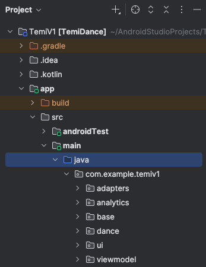
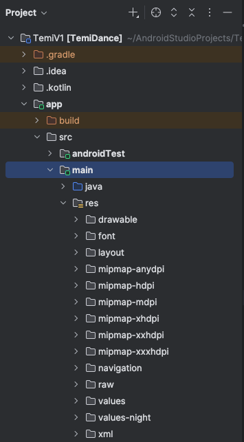

# Temi Dance App Prototype

This is an Android prototype app that generates dance videos for a user to follow based on the 
moves and song they select. It currently has a library of seated dance moves only as the focus is on 
encouraging physical activity amongst older adults of those with accessibility needs.

## Main Features
- **Setup Preferences**
  - Allows the user to setup brightness, volume, and text size to their preference to aid accessibility

- **Physical Capabilities Questions**
    - Asks the user about their current physical mobility and exercise

- **Dance Move Selection**
    - Allows the user to select dance moves they would like to perform

- **Song Selection**
    - Allows the user to choose a song they would like to perform the dance moves to

- **Dance Video Generation and Playback**
    - Based on the moves and song selected generates a playlist of dance moves
    - Plays the dance moves and song together for the user to follow on screen

- **Feedback and Progression**
  - Asks the user some feedback questions to see how they found the dance
  - Offers the user an opportunity to change their level
  - Levels:
    - Easy: 8 reps of each move, 100BPM
    - Medium: 12 reps of each move, 110BPM
    - Hard: 16 reps of each move, 120BPM

- **Logging**
    - Internal logs via Logcat for debugging
    - Exportable logs via CsvLogger for user selections and session analytics

## Project Structure

- **Back-end**

    - Navigate to app/src/main/java/com.example.temiv1 to see backend folders
      - adapters: helpers to get dance moves and songs into recycler view for selection
      - analytics: logs app usage for exportable csv
      - base: base fragment for common fragment functionality inherited by all fragments
      - dance: 
        - data for moves, difficulty level, times of each move (for post study IMU sensor data labelling), and song
        - dance playlist generator that builds a playlist of moves within song duration
      - ui: all fragments that get shown to the user and main activity that hosts the fragments
      - viewmodel: allows for relevant information to be accessible across fragments

- **Front-end**

  - Navigate to app/src/main/res for frontend folders
    - drawable: icons and pictures
    - layout: all fragments, dance and song items, top bar used across all fragments for logo and back button
    - navigation: fragment flow
    - raw: dance move videos and songs
    - values: strings controls the text visible on the fragment in textView component

## Getting Started / Setup
- Simulation: set emulator to Temi device (create yourself) or medium tablet
- Robot: connect to Temi via ADB port to run app on robot
- To download csv of all app logs, when the user reaches the end session screen run: ```bash ./adb -s [adb device address] pull /sdcard/Download/TemiLogs/temi_latest.csv . ``` in terminal inside platform-tools folder to get download from Temi robot onto your computer

## Future Work
- This prototype was used in a user study to assess the use of Temi for accessible dance so can be improved:
  - Get the robot to determine the distance it should be from the user for Q&A vs dance itself and move itself without the researcher needing to move it
  - Offer standing dance routines to expand the user target audience (would need to be safe for the user)
  - Improve interaction by making the robot dance as well
  - Integrate live IMU sensor feedback, in the study sensor data was collected during the dance but was processed after the study to train an AI model to detect specific moves but could be built on to provide user feedback on moves performed correctly during/after the dance
  - The dance moves were aligned to the song by performing them to a metronome at a set BPM and then choosing songs of the same BPM, perhaps alignment could be further improved
